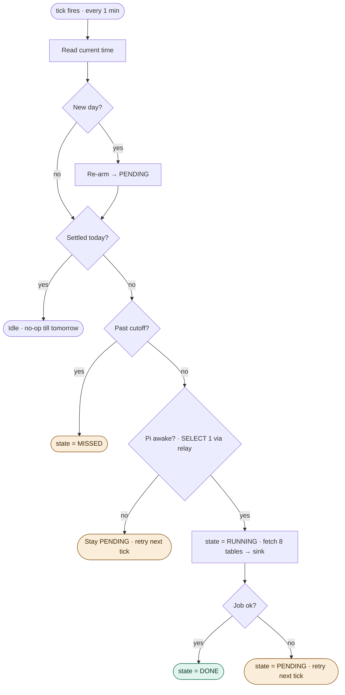

# Azure Relay Hybrid Connection — Pi ↔ Azure

Goal: an Azure container reaches the Pi's PostgreSQL with the Pi making only an
outbound 443 connection. Nothing on the Pi is exposed to the internet.

```
Pi (private)                    Azure Relay                 Azure Container App
┌──────────────┐   outbound     ┌──────────┐   outbound     ┌─────────────────────┐
│ postgres:5432│◄──azbridge────►│  pgdb    │◄───azbridge───►│ 127.0.0.1:5432      │
│ (localhost)  │  RemoteForward │ (hyco)   │  LocalForward  │ ← app / watchdog    │
└──────────────┘                └──────────┘                └─────────────────────┘
```

## 1. Create the relay (once)

```bash
NS=financial-relay
az group create -n rg-financial-rec -l westeurope
az relay namespace create -g rg-financial-rec -n $NS
az relay hyco create -g rg-financial-rec --namespace-name $NS -n pgdb

# least privilege: Pi gets Listen only, Azure gets Send only
az relay hyco authorization-rule create -g rg-financial-rec --namespace-name $NS \
  --hybrid-connection-name pgdb -n pi-listen --rights Listen
az relay hyco authorization-rule create -g rg-financial-rec --namespace-name $NS \
  --hybrid-connection-name pgdb -n azure-send --rights Send

# grab the two connection strings
az relay hyco authorization-rule keys list -g rg-financial-rec --namespace-name $NS \
  --hybrid-connection-name pgdb -n pi-listen  --query primaryConnectionString -o tsv
az relay hyco authorization-rule keys list -g rg-financial-rec --namespace-name $NS \
  --hybrid-connection-name pgdb -n azure-send --query primaryConnectionString -o tsv
```

## 2. Pi side (remote forwarder, as a service)

Download the current **linux-arm64** azbridge release from
<https://github.com/Azure/azure-relay-bridge/releases> into `/opt/azbridge`.

```bash
sudo useradd -r -s /usr/sbin/nologin azbridge
sudo mkdir -p /etc/azbridge
sudo cp infra/relay/pi_config.yml /etc/azbridge/pi_config.yml   # paste the LISTEN connstr
sudo chmod 600 /etc/azbridge/pi_config.yml
sudo cp infra/relay/azbridge-pi.service /etc/systemd/system/
sudo systemctl daemon-reload
sudo systemctl enable --now azbridge-pi
sudo systemctl status azbridge-pi
```

## 3. Azure side (local forwarder, sidecar)

Build and push the sidecar (pin the linux-x64 release URL as a build arg):

```bash
docker build -f infra/relay/Dockerfile.azbridge \
  --build-arg AZBRIDGE_URL="https://github.com/Azure/azure-relay-bridge/releases/download/<VERSION>/<linux-x64-asset>.tar.gz" \
  -t yourregistry.azurecr.io/azbridge-sidecar:<TAG> infra/relay
docker push yourregistry.azurecr.io/azbridge-sidecar:<TAG>
```

Then deploy the app with the sidecar (see `containerapp-watchdog.yaml`). The app
container sets `DATABASE_URL=...@127.0.0.1:5432/...` and never knows the relay
exists.

## 4. Verify

```bash
# from the app container (or locally with azbridge running):
psql "host=127.0.0.1 port=5432 dbname=investments user=... " -c "select 1;"
```

## 5. Daily watchdog run (over this tunnel)

The daily job depends on this relay: the watchdog's liveness check is a real
`SELECT 1` through the tunnel (proving relay + Pi + Postgres are all up), and the
fetch of the 8 source tables travels the same path. The scheduler in
`run_watchdog.py` calls `DailyWatchdog.tick()` once a minute; the state machine in
`app/watchdog.py` decides whether that minute does anything. It runs the fetch at
most once per day — the first minute the Pi is reachable — and re-arms itself at
the next date rollover with no midnight cron.



Notes on the flow:

- The `Pi awake?` decision is the relay-dependent one — if the tunnel, the Pi, or
  Postgres is down, `SELECT 1` fails and the day stays `PENDING`, retrying next
  minute.
- `Past cutoff?` is evaluated in `WATCHDOG_TZ`, so that timezone decides which
  calendar day a given tick belongs to. Set it to your operational timezone.
- The `Job ok? → no` edge retries with no attempt counter: a flaky Pi is retried
  every minute until it succeeds (`DONE`) or the cutoff turns the day `MISSED`.

## Notes

- Azure Relay is Microsoft-supported; **azbridge is open-source and is not** —
  pin a release and watch its repo for updates.
- The relay tunnel is TLS end-to-end regardless of Postgres SSL settings.
- Rotate the SAS keys periodically; the Pi and Azure use different keys so you
  can rotate one side without touching the other.
